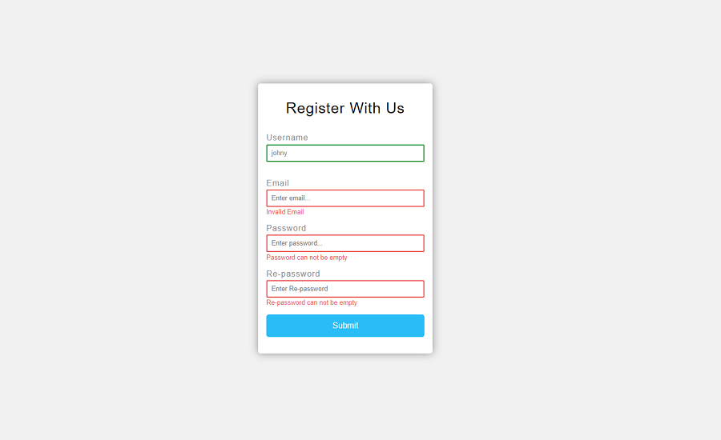

# Form Validator

Form Validator is a javascript app. It is validate data as username, email, password and re-password on a client side. If all data are correct it display appropriate message. It is build for both mobile and desktop views.

## Tools & Technology used

- Visual Studio Code
- JavaScript
- HTML
- SCSS
- Gulp

# gulp-starter

`npm install -g gulp-cli`

`npm install`

`gulp`

To publish your page using github pages use `npm run deploy`
